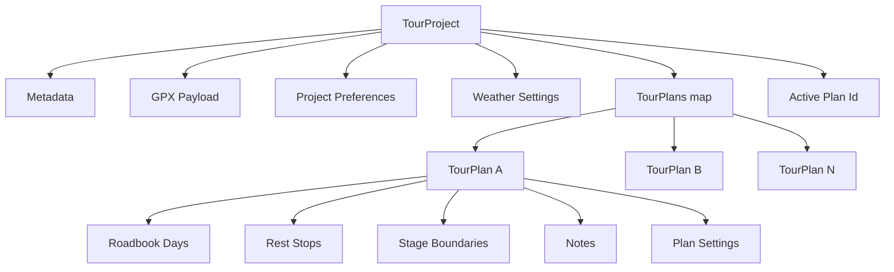
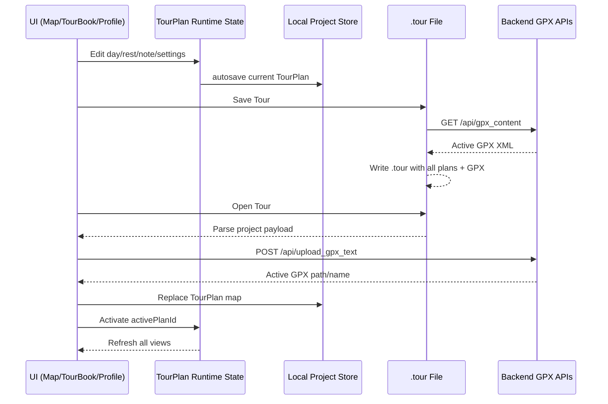

# Touracle Project Architecture

## Sprint 5.3 Scope
Touracle now treats a Tour Project as the primary object. GPX is an import/export component inside that project.

## Sprint 5.4 Scope
Touracle now uses unified weather tile date presentation rules across route map markers and profile cards:
- map cards and endpoint markers: weekday-only date signal
- profile cards: weather-only tile + separate 3-line calendar block
- TourBook full-date display remains unchanged

## Core Model

## Native File Format
Primary file extension: `.tour`

Top-level fields:
- `format`: string discriminator (`touracle-tour-project`)
- `projectVersion`: versioned project format number
- `schemaVersion`: payload schema marker
- `savedAt`: ISO timestamp
- `metadata`: title/app metadata
- `gpx`: embedded GPX and route metadata
- `activePlanId`: selected TourPlan key
- `tourPlans`: all TourPlans in a single object map
- `weatherSettings`: mode and historical-year scope
- `preferences`: departure date, reverse state, day count, route mode
- `future`: reserved extension bucket

The format is forward-compatible by design: unknown keys are ignored by current loaders and preserved by future migration routines where possible.

## Versioning & Migration

### Version fields
- `projectVersion`: semantic migration boundary for TourProject format.
- `schemaVersion`: structural serialization version.

### Migration strategy
1. Detect native project payload via `format`.
2. If missing, treat payload as legacy TourPlan JSON.
3. Promote legacy payload into a synthetic project with one TourPlan.
4. Preserve legacy `tourPlan`/`weatherContext` bridge fields when exporting to improve downgrade compatibility.

## Runtime Data Flow

## Backend Contract (Sprint 5.3)
- `GET /api/gpx_content`: returns active GPX `path`, display `name`, and raw `content`.
- `POST /api/upload_gpx_text`: accepts embedded GPX XML (`name`, `content`) and activates it for the current session.

## File Workflow
Project-centric commands:
- New Tour
- Open Tour
- Save Tour
- Save Tour As
- Import GPX
- Replace GPX
- Export GPX
- Export TourBook (Excel/PDF)

TourBook persistence is removed as a primary concept. TourBook is now a planning/visualization component plus export surface.

## Project Status
Project status follows desktop semantics:
- `Saved`
- `Modified`

Any project-relevant change (ride/rest structure, stage boundaries, notes, dates, weather mode, reverse state, preference edits, GPX replacement) marks the project modified.

## Backward Compatibility
Legacy `.json` TourPlan files remain openable. They are migrated in memory into a one-plan TourProject and can be re-saved as `.tour`.

## Known Limitation / Future Step
Current runtime still stores active plan data via the existing TourPlan local store adapter; the `.tour` project file is the source of truth for cross-session exchange. A future sprint can move all runtime persistence onto a dedicated in-memory `TourProject` singleton with stricter state normalization.
