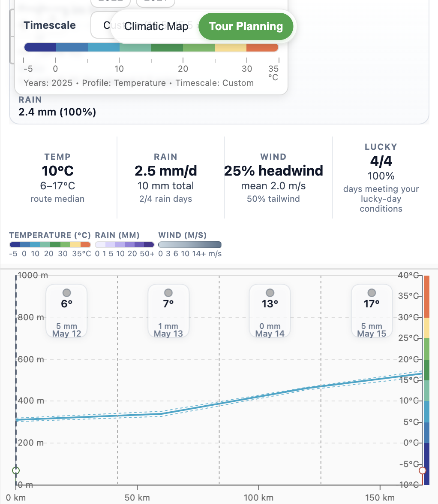
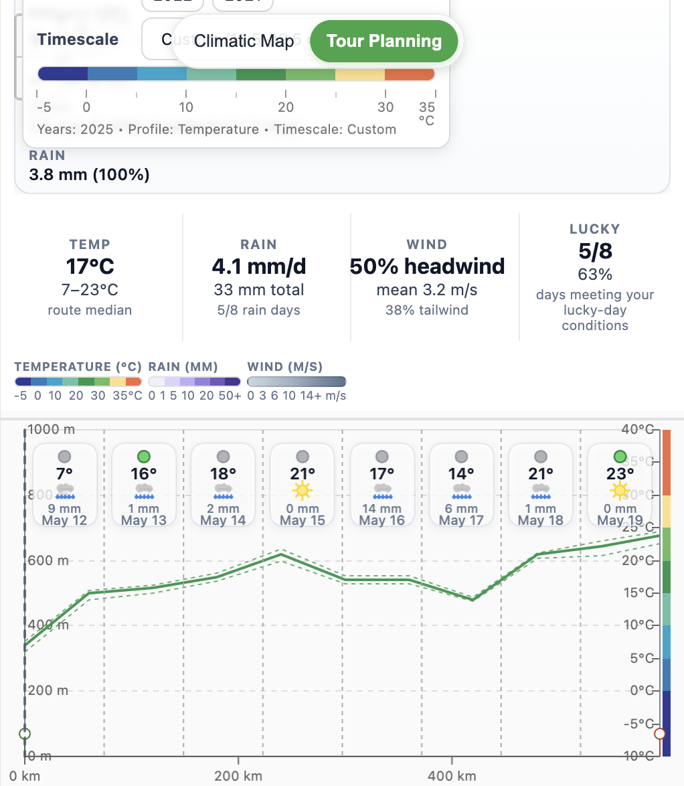
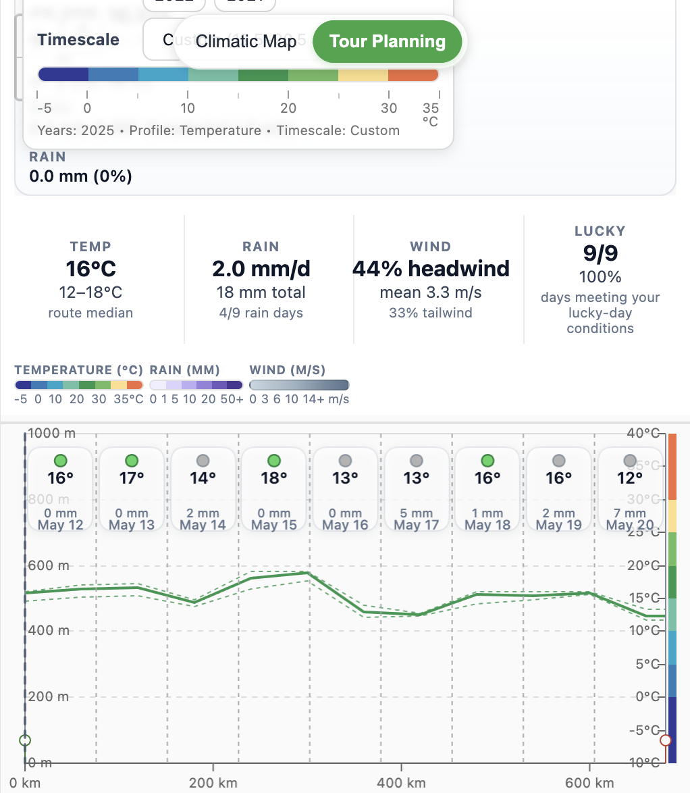

# WeatherMap - teaser

Plan tours with a quick visual weather-comfort check along your GPX route, then switch to Climatic Map mode to explore long-term seasonal patterns.

- Tour Planning: upload a GPX route and get day-by-day weather cards (temperature, rain, icon, lucky-day signal) plus profile context.
- Climatic Map: browse temperature and wind layers by timescale (daily to yearly) for planning windows and route strategy.
- Same route context in both modes: route overlay remains visible while you compare day-level tour conditions vs climate background.

## Screenshots

### Tour Planning - different GPX routes

Freiburg -> Bern

Milano -> Rome

Vienna -> Berlin

### Climatic Map mode

Monthly temperature layer

Weekly wind layer

