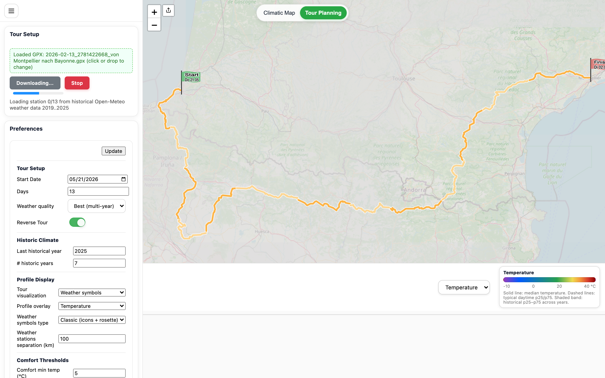
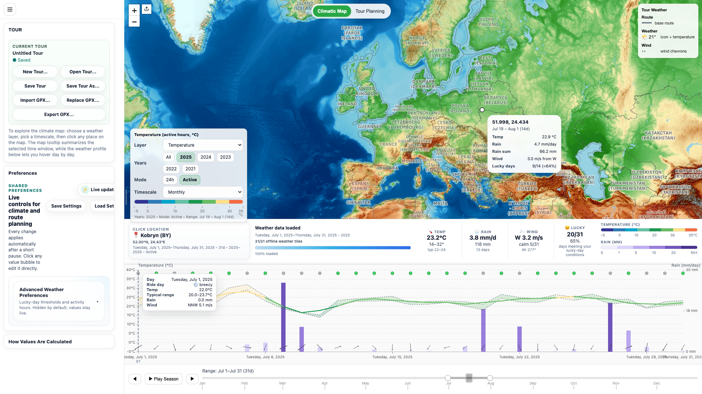
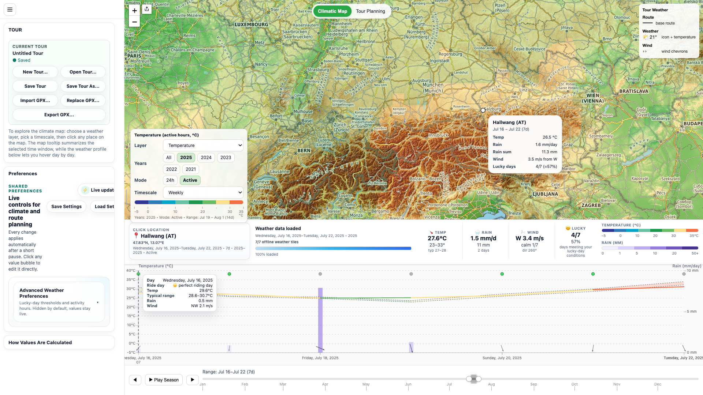

# WeatherMap — teaser

Plan tours with a quick, visual “gut check” of weather comfort along your route — and explore long‑term climate patterns on an interactive map.

- Tour Planning: upload a GPX route, preview conditions, and spot risky days fast. **Per-day cards** on the map and profile strip show temperature, weather icon, rain total, and a lucky-day indicator for each tour day.
- Climatic Map: scrub through the year and switch timescales (daily → weekly → monthly → quarterly → yearly) to see stable patterns.
- One consistent legend: layer, year, and timescale live right on the map.

## Screenshots

### Tour Planning

### Climatic Map — Monthly temperature

### Climatic Map — Weekly wind

### Climatic Map — Monthly rain (Europe)

